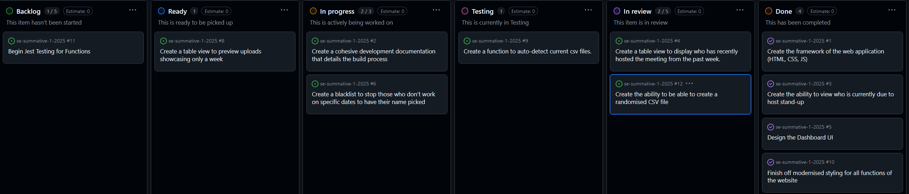
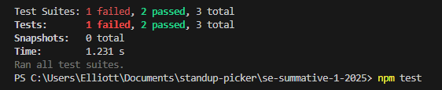

# Centralised Tracking for Stand-Ups
A basic application for those working with daily meetings to track and manage who is due to host a meeting. This application will allow the clients to pass their colleagues names, assign dates to which the stand-ups shall be ran on, pick a randomised name for the stand up host and the ability to export out the scheduling. HTML, CSS and JavaScript are the applications dependencies and is reliant on these to work, whilst Jest will be used to handle testing. Developed by Elliott Hutchins @eh220119a.
## Contents
1. [Reasoning for Application](#reasoning-for-application)
2. [User and Technical Documentation](#user-and-Technical-documentation)
3. [Design and Development Process](#development-and-design-process)
4. [Evaluation of Project](#evaluation-of-project)
## Reasoning for Application
Within the Agile development workspace, teams are usually reliant on repeated daily stand-ups to demonstrate what the team has been working on in the past 24 hours, what is hindering their progress or acting as a blocker, whilst also communicating what is planned to do moving forward. Within our team as we work within the Agile 'Scrum' methodology, we used to have a reliance on a 'scrum-master' who would handle
responsibilites such as organising and handling these short daily sessions but due to organisational shape up we no longer have someone to handle the responsibility of these stand-ups, as we still have not found a replacement scrum-master. 

Due to this, we as an organisation and team believe in sharing this privilege with one another among each member of our product team. The main reasoning for wanting to incorperate such a shift in mentality with this application is to hit three main criteria, with that being; creating a sense of accomplishment and a culture of support by enabling fair and equal participation in our standups, due to the entire team each knowing how it feels to host creating a more supportive environment; developing a belief of collective accountability and ownership, which should benefit both productivity and motivation as everyone on the team shares their part in the sprint board; lastly we want to develop the leadership skills of each of the team members, which could allow them to transfer to different roles within our organisation such as scrummasters, working as a project manager, or a product owner.

Beforehand, we as a team selected stand-up facilitators on an ad-hoc basis, often deciding at the last moment. This spontaneous method sometimes left team members unprepared or placed an undue burden on a few individuals. To address this, we've developed an application that efficiently generates a random facilitation schedule for the entire week. This ensures that each product team member is informed in advance about their designated day to lead the stand-up. Currently, the application serves as a minimum viable product, but we could have further adjustments such as an integration with ServiceNow's REST API's to incorperate the feature set into our daily driving platform to enable centralisation of information.
## User and Technical Documentation 
The User and Technical Documentation section provides comprehensive guidance for both end-users and developers. It ensures that users can effectively utilise the application, while developers can understand its architecture and contribute to its development.

For Users:
*   Features Overview: Detailed descriptions of the application's functionalities.
*   Design

For Technicals:
* System Architecture: An overview of the application's design and components.
* Installation and Setup: Guidelines for setting up the development environment.
* Testing: Information on the testing framework and how to run tests.
### User Documentation
My particular application has a bunch of different functionalities but there is three default steps if you do not have a presaved rotor. If you already have a rotor, the "Upcoming Stand-Up Schedule" will automatically display the first two weeks of the rotor, and display at the top of the screen who's day it is.

**1. Add Team Members**
    - Enter the name of a team member which you want to add to the schedule
    - Tick or untick the days of which they work
    - Press the "+ Add Person" button"
    - Repeat the first step
    - Press the "Randomise and Save" button
    - Stand-Up Schedule should download to your default download location.

**2. Load Stand-Up Schedule to Web Browser**
    - Press on the "Upload Names" button
    - Navigate to your default Download location
    - Input the file you just downloaded.
    - If there are no attendees in your csv file which you downloaded, the stand up schedule will say "No host assigned".

**3. Viewing your stand-up schedule**
    - At the top of your browser, "Today's stand-up host:" should state the person who is due to host
    - To view the entire stand-up schedule scroll to below the "Upload Names" and "Stand-Up scheduler", your stand-up schedule should be displayed for the next fortnight.
**Application Example**
1. Input the names: "Ben", "James", "Hannah", "Dan"
2. Remove the certain days you wish
3. Create your schedule by pressing the "Randomise and Save" button
4. Load your schedule by pressing the "Upload Names" button
5. Inspect the schedule and top banner for the expected names.


### Technical Documentation


| File/Folder          | Reason                                                        |
|----------------------|-----------------------------------------------------------------|
| **index.html**       | Default HTML webpage, contains the sections for "Today's stand up host", "Upload Names", "Stand-Up Scheduler" and the "Upcoming Stand-Up Schedule" |
| **style.css**        | Cascading Style Sheet for the application  |
| **script.js**        | Contains all of the logic for the application to make features such as randomisation, saving of files work etc.  |
| **\_\_tests\_\_/**   | Test scripts for [Jest](https://jestjs.io/)  are all stored within this                           |
| **package.json**     | Lists the dependencies needed to make the program run                |
| **package-lock.json**| Ensures consistent dependencies by locking specific versions    |
| **\_\.node_modules\_\_**         | Contains all the modules required by Node.Js to save extra installation               |
| **jest.config.js** | Contains the passthrough for the Jest Testing suite as the main program isn't reliant on Node |
| **jest.setup.js**  | Contains the variables that Jest will use that aren't accessible with node as the program relies on web browser |

### Installation on your machine and setup process 
1. Clone this repository:

   ```bash
   git clone https://github.com/eh220119a/se-summative-1-2025.git
   cd se-summative-1-2025
   ```
2. Install Dependencies (If you want to use a server)
    ```bash
    npm install live-server
    live-server
    ```

3. Else open 'index.html' in order to execute the application in the browser of your choice.

### Testing Process
 **[Jest](https://jestjs.io/)** has been utilised for testing the logic in `script.js`. The tests used are housed in `__tests__`:
1. Install Jest (must have [Node.js](https://nodejs.org/en/download) installed):

   ```bash
   npm install --save-dev jest
   ```

2. Run Tests:

   ```bash
   npm test
   ```

Sample Test - `displayTodaysHost.test.js` returns correct for who should be on testing duties based upon a forced value.

## Current issues with the Application
- There is not much error handling whatsoever (ie: filtering out duplicate names)
- There is no current ability to autosave the schedule to the server, only via uploading to local storage.

## Design and Development Process
In order for a successful project, a carefully designed software application was needed to be created so that the development of the application would move swiftly and smoothly, for this to be acheived the planning phase must have captured the target audiences needs and appropriately mapped them to the software's design.
### User Stories 
Due to the use of agile, strong user stories were created to give scope to a MVP:
* "As a Team Member, I want to know who is hosting today's stand-up, I want to see the stand-up host for today displayed in the notification bar so that I can easily know who is leading the stand-up."

* "As an Admin, I want to upload a CSV file to update the schedule, I want to upload a CSV file containing the updated stand-up schedule so that I can modify the rota without manual entry."

* "As an Admin, I want to randomise and save a fair schedule, I want to generate a balanced two-week stand-up schedule, ensuring that no team member is overloaded and the schedule is fair."

* "As a Team Member, I want to view the full two-week schedule, I want to see a structured table displaying the upcoming two-week stand-up schedule, so I know who is hosting each day."

The most important part about the 'User Stories', is that they allowed for division into smaller parts of the story, meaning developing the user story became about sufficing each bit of the acceptance critieria. 
Such as, the first user story which turned into: 

"Create the framework of the web application(HTML, CSS,JS)"; "Create the ability to view who is due to host stand-up"; "Finish off modernised styling for all functions of the website".


### Non-Functional Design Prototype for Application
The following image shows the design prototype prior to developing the application which was built using 'Figma' in order to give clarity to how the application would look in regards to it's functionality.


### Project Management

Once the planning and design phase was finalised, the focus shifted to structuring the development process. This was achieved through GitHub and GitHub Projects, which facilitated streamlined workflow management and efficient task tracking.

#### Kanban and Ticket System
In order to progress through the project I took advantage of GitHub Project's Kanban board system, using their issues to create a link between the project and Kanban.



In order to accurately follow through with the agile approach that I am most familiar with, I held two short reviews known as a "Sprint Review" in order to see where I was up to in regards to my workload. I found out due to the length of the project and the time allocated that I could only do a couple short sprints to get myself over the line, in order to stay in line with the 'Scrum' methodology. This is due to the fact of being a sole developer, having to manage every area of the software development lifecycle on my own without the usual supporting cast, is quite overwhelming and difficult. I managed to fit in one 'Sprint Retrospective' which allowed me to look at what I did well and what I did poorly in my sprints which allowed me to kick on and get this project over the line. 

## Experimenting with Test-Driven Development (TDD) in the Project
During the development of the stand-up picker application, I experimented with Test-Driven Development (TDD) to improve the reliability and maintainability of the code. The process involved writing tests before implementing the actual functionality, ensuring that the code met the specified requirements from the start.

I began by defining test cases for key functions using Jest, a JavaScript testing framework. This included functions such as:

   * getFormattedToday() – determining the current stand-up day within a two-week cycle.

   * displayTodaysHost() – updating the notification bar with the correct stand-up host.

   * processSchedule() – reading and displaying the correct stand-up schedule.

Before implementing these functions, I wrote test cases outlining the expected outputs. For example, our test for getFormattedToday() ensured that given a fixed date, the function returned the correct formatted day with its corresponding week number.

2. Running Tests & Watching Failures

Since the functions had not yet been implemented, running the Jest tests initially resulted in failures. This step was crucial as it validated that the test cases correctly defined the expected behavior.



Failure Output:
    ```
    FAIL  __tests__/getFormattedToday.test.js
  ● getFormattedToday › returns the correct formatted day with week number
    Expected: "Monday1"
    Received: undefined
    ```